# School_District_Analysis

The written analysis has the following:

## Overview of the project:
After the completion of school district analysis, the school board notified that the [students_complete.csv](https://github.com/sharof17/Elect) file had evidence of academic dishonesty; reading and math grades for Thomas High School ninth graders seemed to have been altered. Although the full extent of the academic dishonesty was not known, the school board wanted to uphold state-testing standards.

### Purpose
The purpose of the project is to disregard the math and reading scores for Thomas High School ninth graders by replacing them with NaNs while keeping the rest of the data intact.

## Results:
### Impact on District Summary
- The alteration made in the data did not affect the district summary significantly. It can be seen in the following tables: 
  
  *District Summary before*

  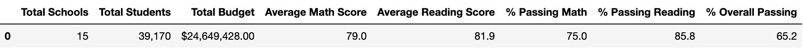
  
  
  *District Summary after*

  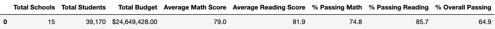

### Impact on School Summary
- Replacing the math and reading scores for Thomas High School ninth graders did not affect the school summary significantly. It is because while calculating the means and percentages, the number of the ninth graders was not considered. The following tables show the results.

  *School Summary before*

  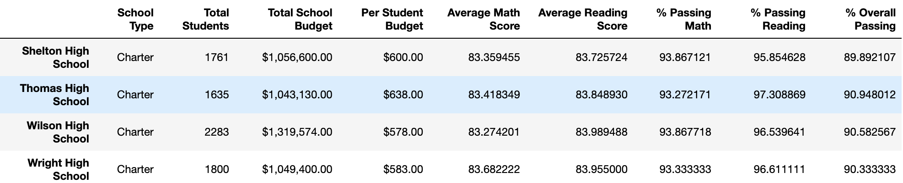

  *School Summary after*

  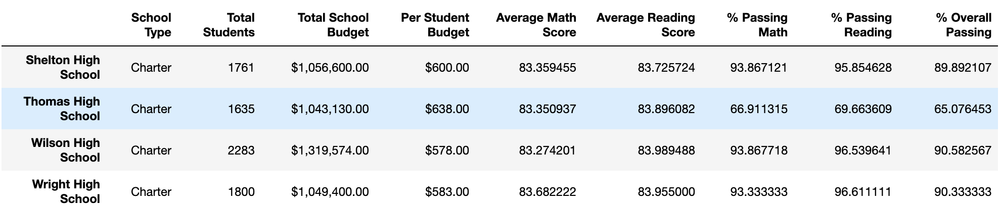

### Impact on performance relative to the other schools
The tables above are sorted in descending order and show that the performace of Thomas High School did not change. It stays on the second position with the Overall Passing Percentage of 90.63. Initially it was 90.95. 

### Effects of replacing the ninth-grade scores:

#### - Math and reading scores by grade

  In the following tables it is clear that instead of the Thomas High School ninth-grade scores there are NaNs. 
  
  *Math scores by grade before*

  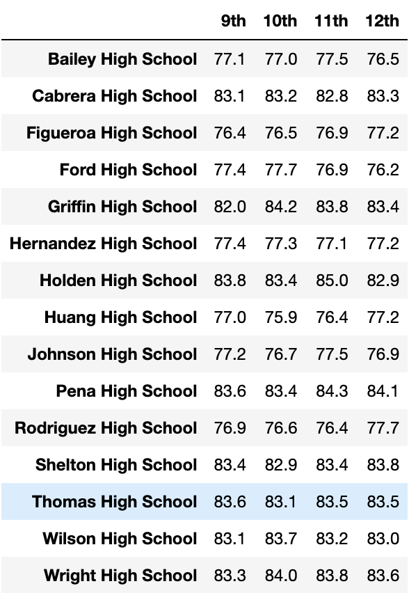
  
  *Math scores by grade after*

  

  *Reading scores by grade before*

  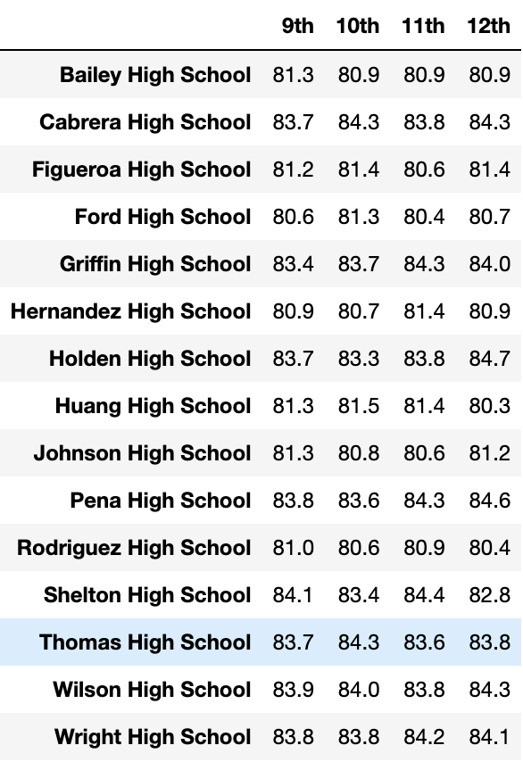

   *Reading scores by grade after*

  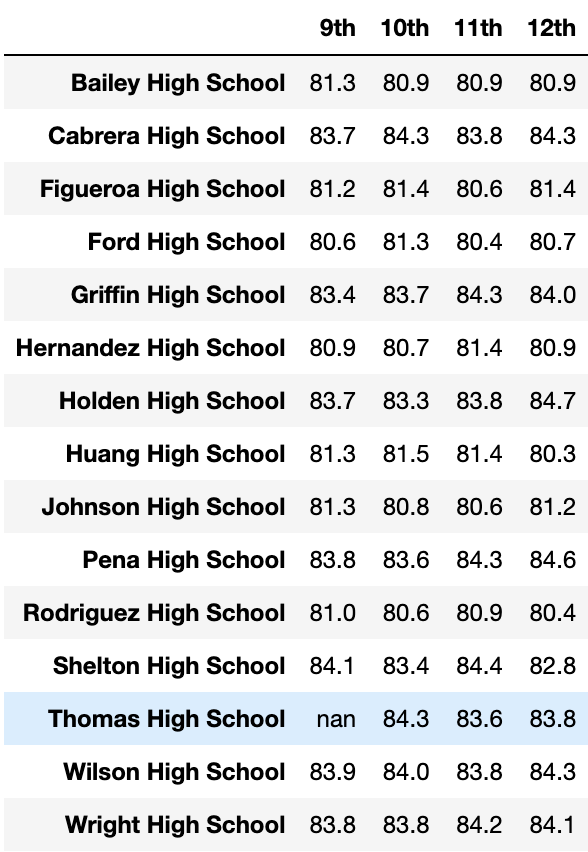

#### - Scores by school spending
  Replacing the ninth graders’ math and reading scores did not have a big effect on scores by school spendgin.
  
  *Before*

  
  
  *After*

  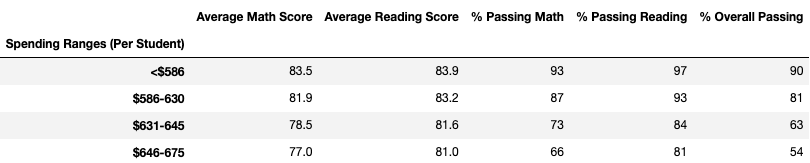

#### - Scores by school size
  As it can be seen in the following tables the alterations did not affect much the analysis results on scores by school size.

  *Before*

  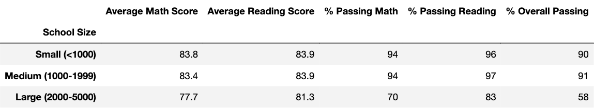

  *After*

  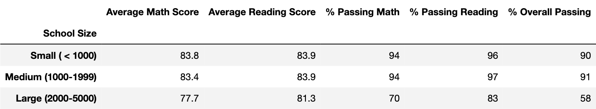

#### - Scores by school type
  The effect of alterations on the scores by school type was not significant either. It
  
   *Before*

  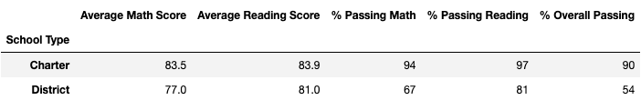

  *After*

  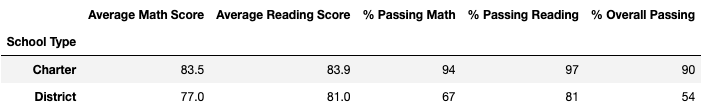

## Summary:
To sum up the project it is important to keep in mind the following issues.
  - The impact on district summary is so insignificant, because in calculation of averages and percentages instead of using total number of students, altered number (39,170-461) of students was used. (39,170-461=38,709)
  - The performance of Thomas High School is on the second place. However, it may have been different if we had the actual results from the ninth grade.
  - Budget per student may change as well due to the actual results of the ninth grade of Thomas High School  which will impact the decision of the school boards on funding allocation.
  - Also, the actual results could change the results of scores by school size analysis. If the performance of the ninth graders is above average level, it will push Medium schools' rating up, and vice versa.