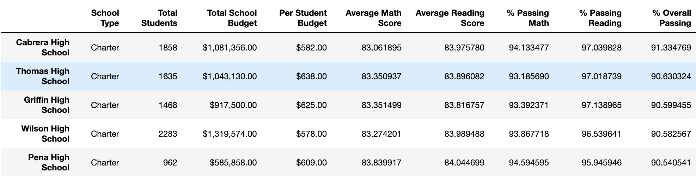
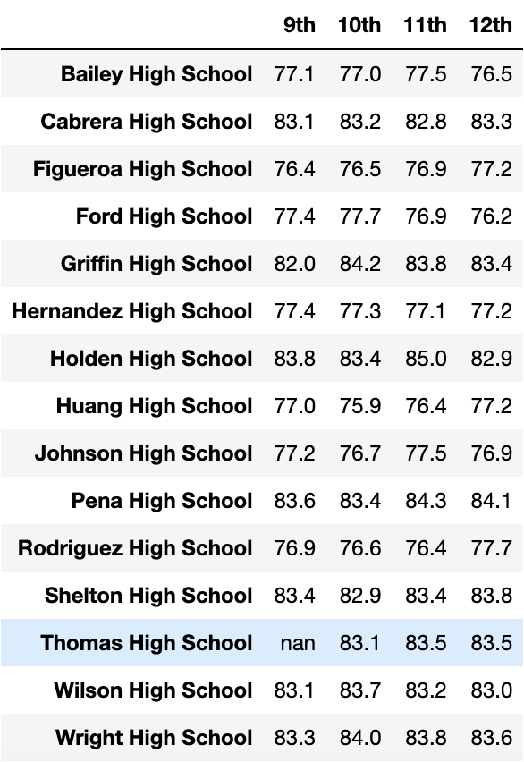

# School_District_Analysis

The written analysis has the following:

## Overview of the project:
After the completion of school district analysis, the school board notified that the [students_complete.csv](https://github.com/sharof17/Elect) file had evidence of academic dishonesty; reading and math grades for Thomas High School ninth graders seemed to have been altered. Although the full extent of the academic dishonesty was not known, the school board wanted to uphold state-testing standards.

### Purpose
The purpose of the project is to disregard the math and reading scores for Thomas High School ninth graders by replacing them with NaNs while keeping the rest of the data intact.

## Results:
- How is the district summary affected?
  
  *District Summary before*
  
  
  
  *District Summary after*
  

- How is the school summary affected?
  
  *School Summary before*
  

    *School Summary after*
  

- How does replacing the ninth graders’ math and reading scores affect Thomas High School’s performance relative to the other schools?
  

- How does replacing the ninth-grade scores affect the following:
    - Math and reading scores by grade
  
  *Math scores by grade before*
  
  
  *Math scores by grade after*
  

  *Reading scores by grade before*
  

   *Reading scores by grade after*
  

    - Scores by school spending
  
  *Per student spending before*
  
  
  *Per student spending after*
  

    - Scores by school size

  *Scores by school size before*
  

  *Scores by school size after*
  

    - Scores by school type
  
   *Scores by school type before*
  

  *Scores by school type after*
  

There is a bulleted list that addresses how each of the seven school district metrics was affected by the changes in the data (10 pt).

## Summary:

There is a statement summarizing four changes to the school district analysis after reading and math scores have been replaced (5 pt).